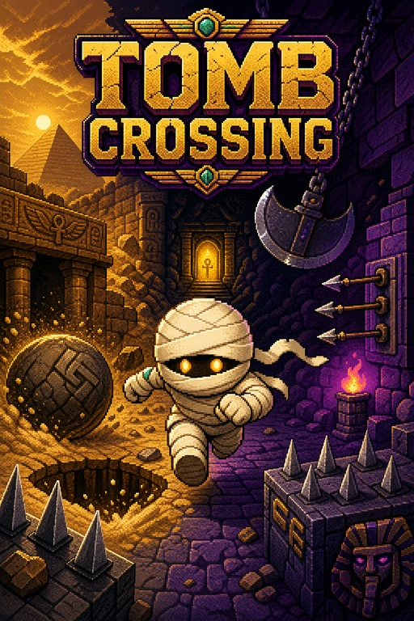

# Tomb Crossing

**Platform:** Game Boy Advance  
**Genre:** Puzzle platformer  
**Version:** v0.1.0

Kha-Men, a mummy awakened after thousands of years, must escape tombs filled
with deceptive floors, sudden spikes, moving hazards, gravity traps, and
psychological fake-outs.

  

## Current Release

The official release contains 40 playable rooms:

| World | Theme | Rooms | Status |
|---|---|---:|---|
| 1 | The Sands of Ra | 1-20 | Available |
| 2 | The Royal Crypts | 21-40 | Available |
| 3 | The Terracotta Labyrinth | 41-60 | Coming Soon |
| 4 | The Temple of Xibalba | 61-80 | Coming Soon |
| 5 | The Warrior's Rest | 81-100 | Coming Soon |

World 3-5 remain visible in the game as `COMING SOON` and cannot be entered.

## Download

Download the playable GBA ROM from the
[Tomb Crossing v0.1.0 release](https://github.com/Ytube2403/GBA_TombCrossing/releases/tag/v0.1.0).

## Controls

| Button | Action |
|---|---|
| D-pad | Move and navigate menus |
| A | Jump or confirm |
| B | Activate a relic or go back |
| Start | Pause or use the highlighted menu action |
| L/R | Change world on selection screens |

## Game Content

- `src/` and `include/`: game runtime source.
- `levels/`: Tiled source maps for the game worlds.
- `graphics/`: character, trap, UI, background, and tileset artwork.
- `audio/` and `dmg_audio/`: music and sound effects.
- `docs/`: game design, controls, level descriptions, and release notes.

## License

Tomb Crossing source code and original project assets are licensed under the
[MIT License](LICENSE). Third-party runtime components retain their respective
licenses; see [THIRD_PARTY_NOTICES.md](THIRD_PARTY_NOTICES.md).
