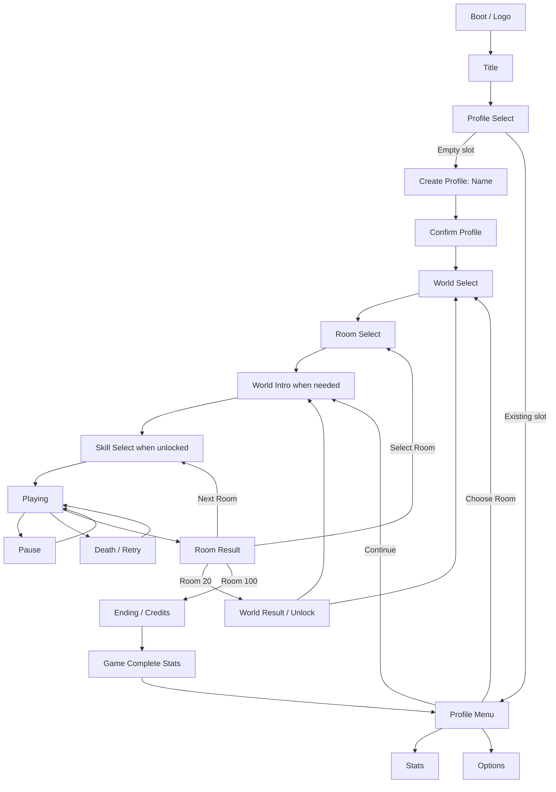

# UI/UX Flow Specification - Tomb Crossing

## 1. Mục tiêu

Tài liệu này là nguồn chuẩn cho luồng sử dụng, danh sách màn hình và nguyên tắc bố cục UI của Tomb Crossing.

Mục tiêu trải nghiệm:

- Người chơi mới hiểu mình là ai, mục tiêu là gì và cách bắt đầu trong dưới 60 giây.
- Người chơi quay lại có thể tiếp tục phòng gần nhất trong tối đa 3 thao tác.
- Chết và chơi lại phải nhanh; hoàn thành phòng phải có cảm giác được ghi nhận.
- Mỗi màn chỉ có một hành động chính nổi bật.
- UI phải đọc được trên màn hình GBA 240 x 160, không dựa vào khung tile 32 x 32 như vùng hiển thị thật.

## 2. Trạng thái triển khai

Tính đến ngày 11/06/2026, frontend mới đã được triển khai trong code.

### 2.1 Luồng màn hình

Luồng chính:

`BOOT -> TITLE -> PROFILE_SELECT -> PROFILE_CREATE/PROFILE_MENU -> WORLD_SELECT -> ROOM_SELECT -> WORLD_INTRO -> SKILL_SELECT -> PLAYING`

Các nhánh gameplay:

- `PLAYING -> PAUSED -> PLAYING/ROOM_SELECT/OPTIONS`
- `PLAYING -> DEAD -> PLAYING`, có input guard 12 frame
- `PLAYING -> ROOM_RESULT -> Next/Retry/Room Select`
- First clear phòng 20/40/60/80 đi qua `WORLD_RESULT`
- Phòng 100 đi qua `ENDING -> CREDITS -> GAME_COMPLETE -> PROFILE_MENU`

Các màn phụ đã có: `STATS`, `OPTIONS`, `SAVE_RECOVERY`, `CONFIRM_DIALOG`.

### 2.2 Kiến trúc và save

- `GameManager` điều phối lifecycle và state transition.
- `FrontendController` quản lý cursor/input và trả action định kiểu.
- `SaveManager` quản lý `SaveFileV2`, ba profile, settings, migration, checksum và dual bank SRAM.
- Save V1 213 byte được migration vào Slot 1 với tên `KHA`.
- Mỗi profile lưu room bitset, deaths, best deaths, play frames, preferred skill và completion.
- `next_room == 100` là completed sentinel và không được dùng làm level/world index.

### 2.3 Layout và presentation

- Tilemap phần cứng vẫn là 32 x 32; API UI clip trong vùng 30 x 20.
- Safe area dùng cột `1..28`, hàng `1..18`.
- World Select dùng một world card lớn; World 3-5 hiển thị `COMING SOON` trong production.
- Room Select là grid 5 x 4; HUD chỉ giữ room, room deaths, gravity và skill khi có.
- Intro, ending và credits dùng `TextReveal` theo setting `text_speed`.
- Options áp dụng music, SFX, flash mode và window palette ngay lập tức.

### 2.4 Phạm vi phát hành

- Production mở World 1-2 qua `ACTIVE_WORLDS`.
- Level và art đang phát triển của World 3-5 vẫn tồn tại nhưng không thuộc
  bản phát hành hiện tại.

## 3. Tham chiếu GBA và bài học áp dụng

### Pokémon Mystery Dungeon: Red Rescue Team

- Tách rõ trải nghiệm lần đầu và trải nghiệm tiếp tục.
- Lần đầu có chuỗi onboarding, đặt tên; lần sau hiển thị menu Continue kèm metadata.
- Dùng quy ước nhất quán: D-pad di chuyển, `A` xác nhận, `B` hủy.

Áp dụng: tạo profile chỉ xuất hiện với slot trống; profile đã có phải hiển thị ngay tiến độ và cho Continue nhanh.

### Mario vs. Donkey Kong

- Dùng ba data slot ngay sau title.
- Level Selection là màn trung tâm; chỉ level đầu mở ở save mới và level sau mở dần.
- HUD gameplay chỉ giữ thông tin có tác dụng tức thời.

Áp dụng: ba profile vừa đủ cho GBA, sau profile là World/Room Select có khóa và tiến độ trực quan.

### Wario Land 4 và các platformer GBA

- Hub/level select dùng landmark hoặc card lớn thay vì nhiều text cùng cấp.
- Kết thúc level tạo nhịp nghỉ và phần thưởng trước khi đưa người chơi trở lại lựa chọn tiếp theo.

Áp dụng: world card lớn ở giữa; result screen có thứ tự rõ `CLEARED -> stats -> next action`.

Nguồn tham khảo chính thức:

- [Nintendo - Game Boy Advance game manuals](https://www.nintendo.com/en-gb/Support/Legacy-system/Game-Boy-Advance-games-manuals-928652.html)
- [Pokémon Mystery Dungeon: Red Rescue Team manual](https://www.nintendo.com/eu/media/downloads/games_8/emanuals/game_boy_advance_8/Manual_GameBoyAdvance_PokemonMysteryDungeonRedRescueTeam_EN.pdf)
- [Mario vs. Donkey Kong manual](https://www.nintendo.com/eu/media/downloads/games_8/emanuals/game_boy_advance_8/Manual_GameBoyAdvance_MarioVsDonkeyKong_EN_DE_FR_ES_IT.pdf)
- [Wario Land 4 manual](https://www.nintendo.com/eu/media/downloads/games_8/emanuals/game_boy_advance_8/Manual_GameBoyAdvance_WarioLand4_EN_DE_FR_ES_IT.pdf)

## 4. Luồng sử dụng mục tiêu



### 4.1 Đường đi nhanh

- Save mới: `Title -> Empty Slot -> Name -> Confirm -> World 1 -> Room 1`.
- Người chơi quay lại: `Title -> Profile -> Continue`.
- Replay: `Title -> Profile -> Choose Room -> World -> Room`.
- Sau khi chết: một nút bất kỳ trong nhóm `A/B/START` để retry, không qua màn phụ.

## 5. Screen inventory

### P0 - Bắt buộc cho luồng hoàn chỉnh

| ID | Màn hình | Mục đích | Hành động chính |
|---|---|---|---|
| S00 | Boot/Logo | Nhận diện game, load save | Tự qua |
| S01 | Title | Điểm vào | `START` |
| S02 | Profile Select | Chọn 1 trong 3 save slot | `A` chọn |
| S03 | Profile Name | Nhập tên tối đa 8 ký tự | `A`, `B`, `START=END` |
| S04 | Profile Confirm | Tránh tạo nhầm | Confirm / Back |
| S05 | Profile Menu | Continue, Choose Room, Stats, Options | Continue |
| S06 | World Select | Chọn world | `A` mở |
| S07 | Room Select | Xem 20 phòng, khóa/clear/current | `A` chơi |
| S08 | World Intro | Thiết lập bối cảnh ngắn | `A` skip |
| S09 | Skill Select | Chọn kỹ năng hoặc No Skill | `A` chọn, `B` none |
| S10 | Gameplay + HUD | Chơi | Move/Jump/Skill |
| S11 | Pause | Continue, Restart, Room Select | Continue |
| S12 | Death | Hiện deaths và retry | Retry |
| S13 | Room Result | Xác nhận qua phòng, deaths, tiến độ | Next Room |
| S14 | World Result | Tổng kết và world unlock | Next World |
| S15 | Ending/Credits | Kết thúc hành trình | Skip/Continue |
| S16 | Game Complete | Tổng stats của profile | Back to Profile |

### P1 - Nên có

| ID | Màn hình | Nội dung |
|---|---|---|
| S17 | Stats | Rooms cleared, total deaths, worst room, skill use |
| S18 | Options | Text speed, music, SFX, screen flash, window palette |
| S19 | Delete Profile Confirm | Xác nhận hai bước, hiển thị đúng tên slot |
| S20 | Save Error/Recovery | Save hỏng, migration thất bại, khởi tạo lại |

## 6. Quy chuẩn điều khiển

| Input | Quy ước toàn game |
|---|---|
| D-pad | Di chuyển cursor hoặc nhân vật |
| `A` | Xác nhận / Jump |
| `B` | Quay lại / Kích hoạt skill trong gameplay |
| `START` | Bắt đầu / Pause / xác nhận nhanh ở màn result |
| `SELECT` | Chức năng phụ hiếm; không dùng làm thao tác phá hủy save trực tiếp |
| `L/R` | Đổi page/world nhanh ở Room Select nếu cần |

Không thay đổi nghĩa `A=confirm`, `B=back` giữa các menu. Thao tác xóa profile phải qua Profile Menu và hai bước xác nhận, không đặt ẩn trên Title.

## 7. Quy chuẩn layout GBA

### 7.1 Lưới và safe area

- Màn thật: `240 x 160 px`.
- Lưới text 8 px: `30 x 20 tile`.
- Safe area mặc định: cột `1..28`, hàng `1..18`.
- Căn giữa theo 30 cột: `x = (30 - text_length) / 2`.
- Không đặt text bắt đầu ở cột 29 nếu dài hơn một ký tự.
- Mỗi màn chỉ nên có tối đa 3 cấp nhấn: title, focus card, footer hint.

### 7.2 Phân vùng chuẩn

```text
+------------------------------+ y=0
| TITLE / CONTEXT              | 2-3 tile rows
|------------------------------|
|                              |
| PRIMARY FOCUS                | 10-12 tile rows
|                              |
|------------------------------|
| A:SELECT  B:BACK             | 2 tile rows
+------------------------------+ y=19
```

### 7.3 Màu và focus

- Nền tối theo world, panel sáng vừa đủ tương phản.
- Cursor chọn dùng hai tín hiệu: màu + hình dạng/arrow. Không chỉ đổi màu.
- Item khóa dùng lock icon và text điều kiện ngắn.
- Text nhấp nháy chỉ dành cho prompt chờ input, không dùng cho tiêu đề.
- Animation focus 2-4 frame, biên độ nhỏ để tránh gây nhiễu.

## 8. Đặc tả các màn chính

### S02 - Profile Select

Ba slot xếp dọc, mỗi slot cao 4 tile. Chỉ một slot có viền sáng.

```text
       SELECT PROFILE

  > KHA      ROOM 23   47D
    WORLD 2  ROYAL CRYPTS

    EMPTY SLOT

    EMPTY SLOT

  A:SELECT        B:TITLE
```

Metadata ưu tiên: tên, phòng tiếp theo, total deaths, world. Không hiển thị quá 2 dòng/slot.

### S03 - Profile Name

- Tối đa 8 ký tự ASCII in hoa.
- Có preset `KHA`, `MEN`, `MUMMY`, `PLAYER`.
- Keyboard chia nhóm 6-8 ký tự/hàng.
- `B` xóa; giữ `B` lặp sau delay; `START` nhảy đến `END`.

### S06 - World Select

Không hiển thị 5 card nhỏ cùng lúc. Dùng một card lớn ở giữa, hai world lân cận chỉ lộ mép hoặc icon.

```text
          CHOOSE WORLD

       <  WORLD 2  >
        THE ROYAL CRYPTS
          [ ARTWORK ]

        07 / 20 CLEARED
        NEXT: ROOM 28

  A:ROOMS   B:PROFILE   L/R:MOVE
```

World khóa hiển thị `CLEAR WORLD 1 TO UNLOCK`. World chưa phát hành hiển thị `COMING SOON`, tách biệt với trạng thái khóa tiến độ.

### S07 - Room Select

- Grid `5 x 4`, mỗi ô 4 x 3 tile.
- Trạng thái: locked, available, cleared, current.
- Panel dưới hiển thị tên room ngắn, best deaths, skill rule.
- Cursor không wrap qua world khác; dùng `L/R` đổi world.

### S09 - Skill Select

Không đặt ba card rộng 8 ký tự rồi cắt mô tả. Dùng danh sách trái và panel mô tả phải:

```text
        CHOOSE ONE RELIC

  > BOOTS      SUPER JUMP
    CLOAK      AIR DASH
    SHRINK     TINY 3 SEC
    NO RELIC

  ONE USE IN THIS ROOM
  A:SELECT           B:NO RELIC
```

Nếu world chưa có skill, bỏ qua màn này. Lựa chọn gần nhất có thể được focus mặc định, nhưng người chơi vẫn phải xác nhận.

### S10 - Gameplay HUD

Mục tiêu là giữ gameplay area rộng nhất có thể.

Hàng 0:

`ROOM 23        DEATH 0047        gravity icon`

Hàng 1 chỉ xuất hiện khi có skill:

`BOOTS  B:READY` hoặc `BOOTS  USED`

Tên world không cần lặp liên tục trong HUD vì đã có World Intro và palette riêng. Nếu giữ, chỉ hiển thị ở 90 frame đầu phòng.

### S11 - Pause

Menu dọc, một cursor:

```text
            PAUSED

          > CONTINUE
            RESTART ROOM
            ROOM SELECT
            OPTIONS

       A:SELECT  B:CONTINUE
```

`RESTART ROOM` và `ROOM SELECT` cần confirm nếu làm mất run hiện tại. Không gán nhiều action khác nhau trực tiếp cho `A/B/SELECT` trên cùng một dòng.

### S12 - Death

Giữ màn này cực ngắn:

```text
           YOU DIED

       ROOM DEATHS: 004

       A/B/START: RETRY
```

- Có thể cho phép input sau 10-15 frame để tránh bấm nhầm từ gameplay.
- Không fade dài; tổng thời gian từ input retry đến điều khiển lại dưới 500 ms.

### S13 - Room Result

```text
          ROOM 23 CLEAR

          DEATHS      4
          BEST        2
          WORLD     8/20

        > NEXT ROOM
          RETRY ROOM
          ROOM SELECT

       A:SELECT  B:BACK
```

Trình tự:

1. `CLEAR` và fanfare trong 30-45 frame.
2. Stats xuất hiện trong 15-20 frame.
3. Menu action nhận input.
4. Không auto-advance khi menu đã hiện; `START` có thể là shortcut Next Room.

Nếu chưa lưu xong, hiển thị `SAVING...` ở góc dưới; chỉ cho thoát sau khi write hoàn tất.

### S14 - World Result

Hiển thị sau Room 20/40/60/80:

- World name + `ESCAPED`.
- `20/20 ROOMS`.
- World deaths.
- Skill/world mới được mở.
- `NEXT WORLD` là action chính, `WORLD SELECT` là action phụ.

### S16 - Game Complete

Tách thành ba nhịp:

1. Ending scene: Kha-Men thoát khỏi lăng.
2. Credits có thể skip.
3. Profile result: rooms `100/100`, total deaths, hardest room, completion badge.

Không đặt `START=restart from World 1`; hành động mặc định là trở về Profile Menu. Replay bắt đầu từ Room Select và không xóa tiến độ.

## 9. Mô hình save/profile đề xuất

```cpp
struct SaveHeader {
    char magic[4];
    uint8_t version;
    uint8_t active_slot;
    uint8_t slot_count;
    uint8_t checksum;
};

struct ProfileData {
    char name[9];
    uint8_t highest_level;       // 0..100, 100 = completed
    uint8_t world_unlocked;
    uint8_t skills_unlocked;
    uint8_t preferred_skill;
    uint32_t total_deaths;
    uint32_t play_frames;
    uint16_t level_deaths[100];
    uint16_t best_level_deaths[100];
    uint8_t settings_flags;
    uint8_t checksum;
};
```

Yêu cầu:

- Ba profile slot.
- Save version bắt buộc.
- `highest_level == 100` phải được xử lý như completed, không dùng làm index level.
- Migration v1: đưa save cũ vào slot 1 với tên mặc định `KHA`.
- Checksum riêng cho từng profile để một slot hỏng không phá tất cả.
- Không reset save bằng shortcut ẩn ở Title.

## 10. State machine đề xuất

Tách state hiển thị khỏi state dữ liệu:

```text
BOOT
TITLE
PROFILE_SELECT
PROFILE_CREATE
PROFILE_MENU
WORLD_SELECT
ROOM_SELECT
WORLD_INTRO
SKILL_SELECT
PLAYING
PAUSED
DEATH_RESULT
ROOM_RESULT
WORLD_RESULT
ENDING
CREDITS
GAME_COMPLETE
STATS
OPTIONS
CONFIRM_DIALOG
```

`CONFIRM_DIALOG` nên là overlay dùng lại cho delete profile, restart room và quit run, thay vì thêm bool riêng cho từng màn.

## 11. Kế hoạch triển khai

### Phase 1 - Sửa nền tảng và luồng P0

1. Chuẩn hóa UI theo lưới 30 x 20 và helper căn giữa.
2. Thêm save version, ba profile và migration.
3. Thêm Profile Select/Create/Menu.
4. Thêm Room Select.
5. Nâng Room Result và thêm World Result.
6. Sửa completed progress để không index level 100.

### Phase 2 - Cải thiện layout hiện có

1. World Select một card lớn.
2. Skill Select dạng list + detail.
3. Pause menu dạng cursor.
4. Giảm HUD còn thông tin tức thời.
5. Thêm save feedback và confirm overlay dùng chung.

### Phase 3 - Polish

1. Ending/credits.
2. Stats/options.
3. Artwork riêng theo world.
4. Transition, audio cue và animation focus.

## 12. Acceptance criteria UI/UX

- Save mới không thể vào gameplay mà chưa tạo/chọn profile.
- Save cũ được migration và tiếp tục đúng phòng.
- Từ Title đến Continue gameplay không quá 3 confirm input.
- Có thể replay bất kỳ room đã clear.
- Room Result không tự bỏ qua lựa chọn của người chơi.
- Qua Room 20 có World Result và thông báo unlock.
- Hoàn thành Room 100 không đọc ngoài mảng và không xóa tiến độ.
- Tất cả text nằm trong 30 x 20 tile hiển thị.
- Mọi menu tuân thủ `A=confirm`, `B=back`.
